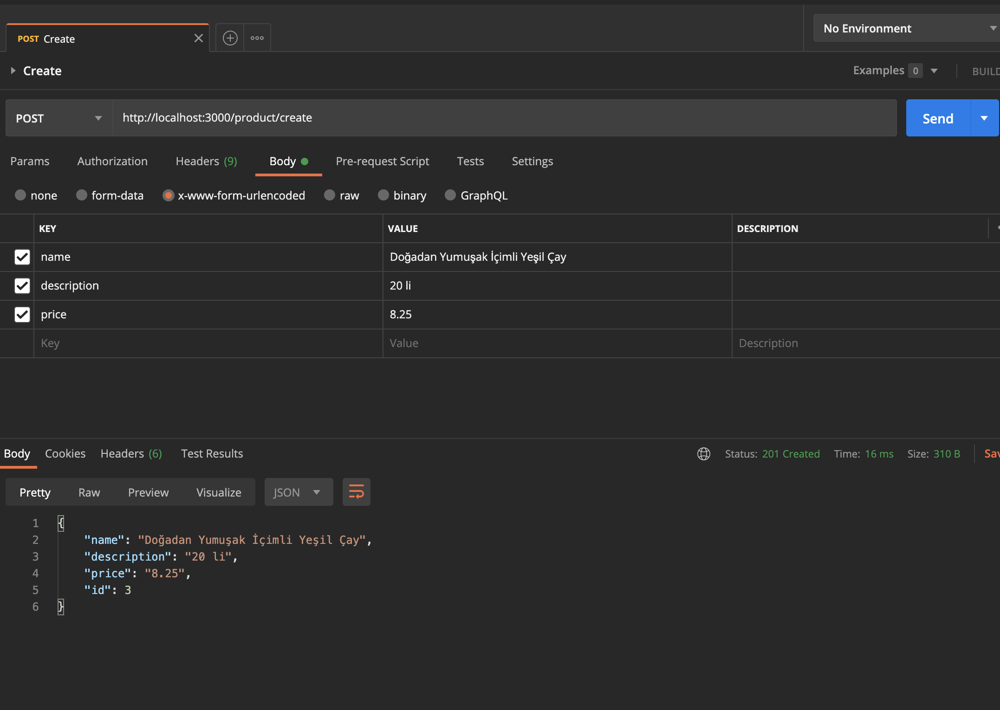
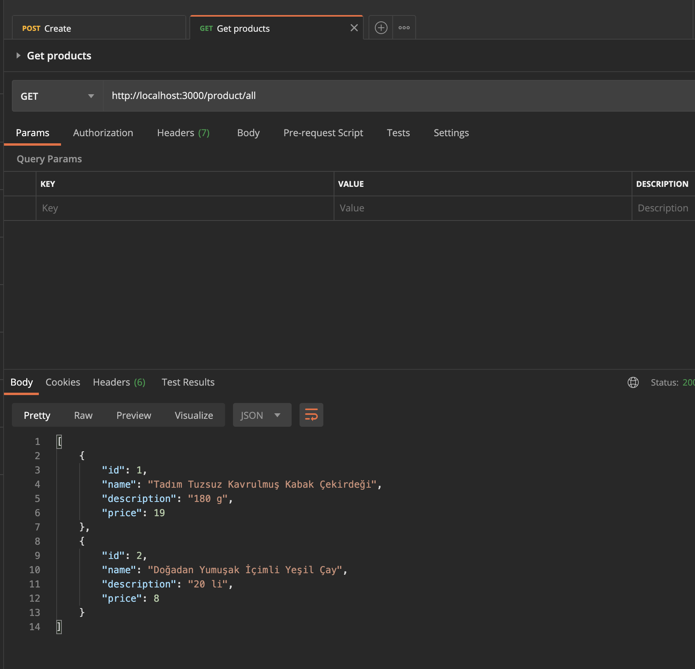
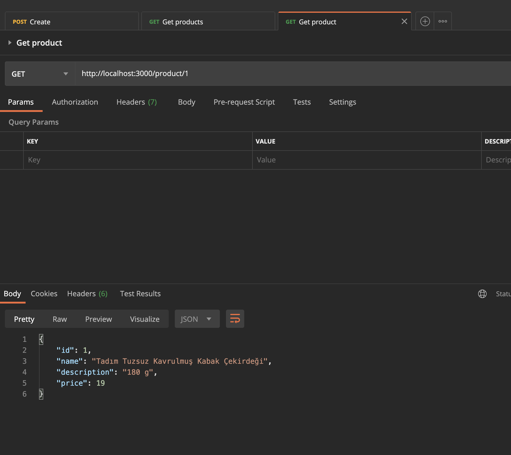

# Getting started with continuous integration for Nest.js APIs

I will build a RESTful API with Nest.js. I learned some recommended approach to writing tests for each API endpoint.
Finally, I will be able to automate the testing process using CircleCI. 

This project will be able to create, retrieve, edit and delete items and saved in the database.
I make use of MySQL and combine TypeORM.

### Scaffolding
Run this command for generating new module (also module name is product)

```bash
$ nest generate module product
```

Run this command for generating new service  
```bash
$ nest generate service product
```

## Create Product


## Get Products


## Get Single Product


## TODOS
- Dockerize project and integrate kubernetes
- Deploy and integrate with some free cloud providers.

