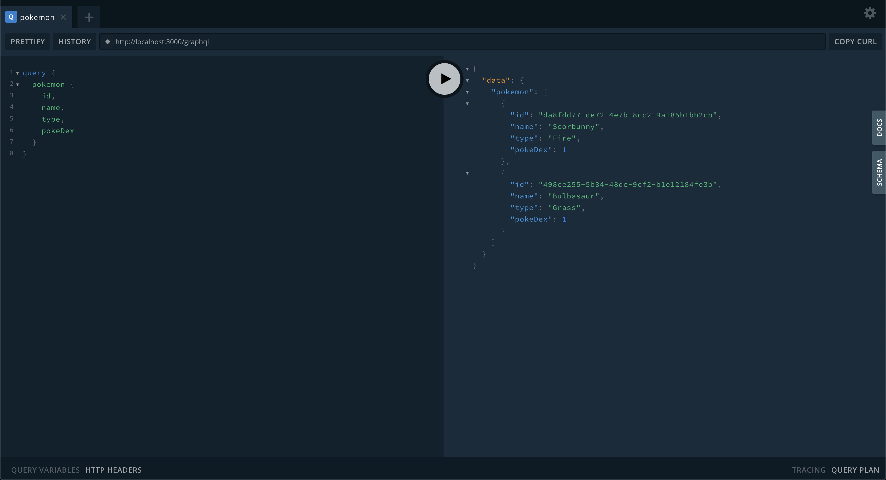
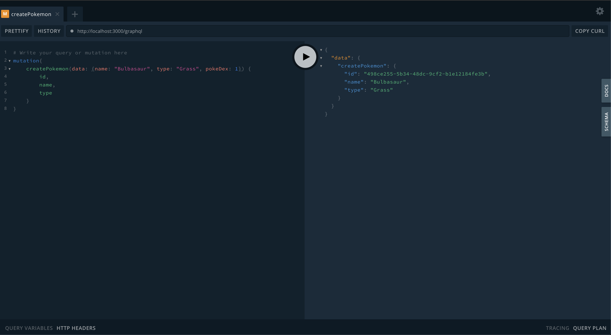

# NestJS GraphQL API with TypeORM and Postgres

I will build a GraphQL API with Nest.js. 

## Why GraphQL?
There is a problem in front-end development.
What if the frontend requirements change and we need an extra data field that is only available through a separate endpoint?
Now we have to make two HTTP requests and we will have extra data which is wasteful for mobile internet usage.
The other solution is to create a new endpoint on the backend, which is expensive.

## Downside of REST
Take Next.JS as an example. Next lets you define APIs with a very lightweight syntax. Instead of making multiple requests from the client, you can wrap those calls into an API and make them server-side. Over and underfetching can be solved with this approach too, as you can manipulate the data before sending it back to the client. The pattern described is named "backend for frontend" (BFF). It's not limited to full stack frameworks like Next.JS. You can build a BFF for your mobile apps as well.

With the BFF pattern, the client itself doesn't have to know the location of each service. However, the developer who implements the BFF needs to understand the service landscape. Hopefully you have Open API Specifications for all your services, nicely presented in a developer portal. If that's the case, it should be easy to write a BFF.

With GraphQL, there still needs to be a developer who implements the resolvers. Implementing the resolvers is more or less the same task as building a BFF, the logic is very similar.

But you have to build a BFF for each individual frontend. If you have many of them this can be a lot of work. You have to maintain all the BFFs. You have to operate them. You have to secure them.


## My GraphQL Example
I make use of PostgreSQL and combine TypeORM.

For creating postgresql db 
```bash
$ sudo -u postgres psql
postgres=# createdb poke_db
postgres=# \q
$ psql
poke_db=# \password
poke_db=# Enter new password:
poke_db=# Retype new password:
```

Sample Queries
```bash
{
    pokemon(id: 4) {
        name,
        types
    }
}

# JSON returns

{
    "data": {
        "pokemon": {
            "name": "Charmander",
            "types": ["Fire"]
        }
    }
}

mutation{
    addPokemon(name: "Scorbunny", types: "Fire") {
        id,
        name,
        types
    }
}

{
    "data": {
        "pokemon": {
            "id": 912,
            "name": "Scorbunny",
            "types": ["Fire"]
        }
    }
}
``` 

For running  

```bash
$ npm run start:dev
```

Navigate to localhost:3000/graphql

## Query


## Mutation
