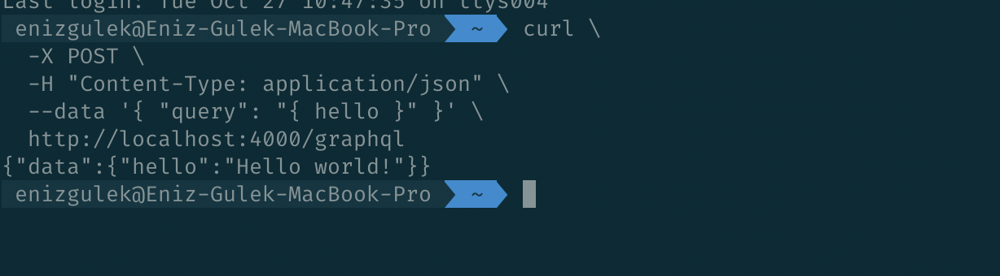
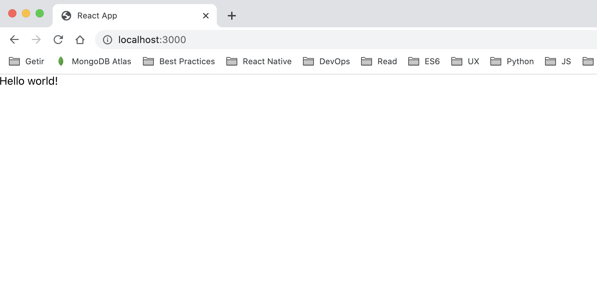

# Creating GraphQL client and server using Apollo

GraphQL is a great way to let the client decide which data they want to be transmitted over the network, rather than having the server send a fixed set of data.

Also, it allows you to specify nested resources, reducing a lot the back and forth sometimes required when dealing with REST APIs.

Apollo is a team and community that builds on top of GraphQL, and provides different tools that help you build your projects.

The tools provided by Apollo are mainly 3: Client, Server, Engine.

- Apollo Client helps you consume a GraphQL API
- Apollo Server is the server part of GraphQL
- Apollo Engine is a hosted infrastructure (SAAS) that serves as a middle man between the client and your server, providing caching, performance reporting, load measurement, error tracking, schema field usage statistics, historical stats and many more goodies.

## Query

## Browser

