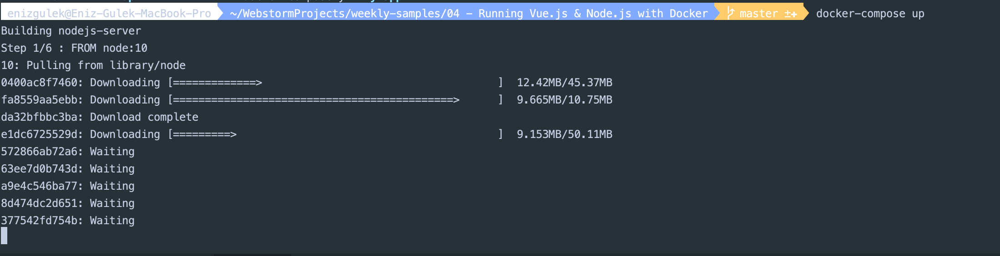

# Running Vue.js & Node.js app with Docker Compose

Docker Compose is really useful when we don’t have the development environment setup on our local machine to run all parts of the application to test or we want to run all parts of the application with one command. For example, if you want to run Vue.js and nodes express index on different ports and you need a single command to run you can accomplish that with Docker Compose.

Docker-compose is a tool that is used for multi-container applications in a single host. As we can see in the following figure, we can run multi containers as services in the single host with the help of docker-compose.yaml.

Some useful docker commands 

```bash
# create and start containers
docker-compose up

# start specific service
docker-compose up <service-name>

# display running containers
docker-compose top

# list docker images
docker-compose images

# list docker containers
docker-compose ps 
```

I build a example project running Vue.js app with Node.js backend.

I set up my local development enviroment with Docker Compose


