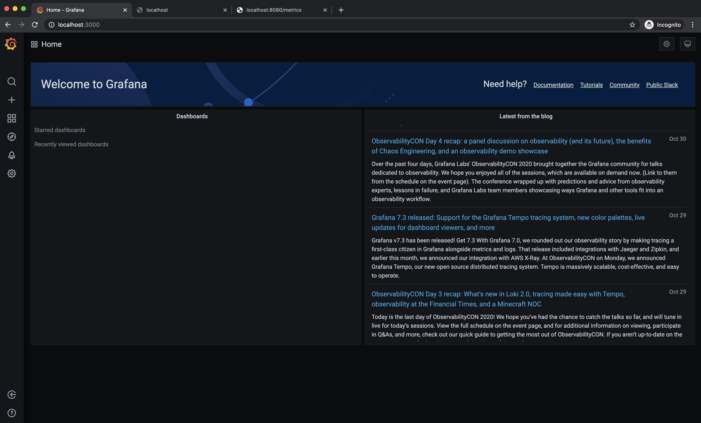

# Node.js Application Monitoring with Prometheus and Grafana

Prometheus is an open-source monitoring system which was created in 2012 by Soundcloud. In 2016, Prometheus became the second project (following Kubernetes) to be hosted by the Cloud Native Computing Foundation.

The Prometheus server collects metrics from your servers and other monitoring targets by pulling their metric endpoints over HTTP at a predefined time interval. For ephemeral and batch jobs, for which metrics can't be scraped periodically due to their short-lived nature, Prometheus offers a Pushgateway. This is an intermediate server that monitoring targets can push their metrics to before exiting. The data is retained there until the Prometheus server pulls it later.

Grafana is a web application that allows you to visualize data sources. A visualization can be a graph or chart. It comes with a variety of chart types, allowing you to choose whatever fits your monitoring data needs. Multiple charts are grouped into dashboards in Grafana, so that multiple metrics can be viewed at once.

Start the Docker containers:

```bash
$ docker-compose up -d
```

Prometheus should be accessible via http://localhost:9090

Grafana should be accessible via http://localhost:3000

Example Node.js server metrics for RED monitoring should be accessible via http://localhost:8080/metrics


